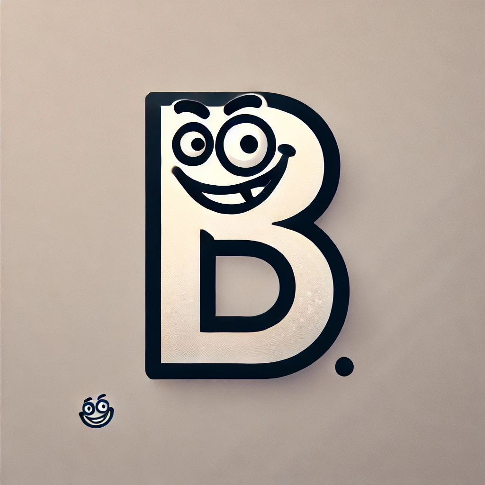

# A hugo theme to build **m**odern **A**scii**D**oc-based **b**logs.



A humble for of "https://github.com/basil/antora-default-ui-hugo-theme/" that drifts from its main purpose to
build a more blogging-like simple and modern platform.

[](https://github.com/basil/antora-default-ui-hugo-theme/blob/master/LICENSE)

Antora Default UI Theme for Hugo is a Hugo theme based on the [Antora default UI](https://gitlab.com/antora/antora-ui-default), with full support for [Asciidoctor](https://asciidoctor.org/). **([_Demo_](https://antora-default-ui-hugo-theme.netlify.app/))**

## Screenshot

TODO

## Prerequisites

Before starting, ensure that you have [installed Hugo](https://gohugo.io/getting-started/quick-start/#step-1-install-hugo) and [created a new site](https://gohugo.io/getting-started/quick-start/#step-2-create-a-new-site).

Also ensure that you have [installed Asciidoctor](https://asciidoctor.org/docs/install-toolchain/).

## Installation

TODO: Demo with the modern hugo module workflow.

## Configuration

Configure the Asciidoctor attributes in your site's configuration file (`config.toml`) for use with this theme:

```toml
[markup]
  [markup.asciidocext]
    [markup.asciidocext.attributes]
      "icons" = "font"
      "source-highlighter" = "rouge"
  [markup.highlight]
    codeFences = true
```

Optionally, configure a description and keywords for the home page:

```toml
[params]
  description = "Lorem ipsum dolor sit amet, consectetur adipiscing elit."
  keywords = ["foo", "bar"]
```

Optionally, configure a copyright message and year for the footer:

```toml
copyright = "<name>. All rights reserved."

[params]
  since = <year>
```

Optionally, configure a URL for use with the **Edit this page** feature:

```toml
[params]
  editThisPage = "https://github.com/organization/repository/edit/main/content/"
```

### Customization

Custom CSS can be added to `assets/css/custom.css`.

### Syntax Highlighting

TODO: Document better how to work with rouge.
This theme uses [Rouge](https://rouge.jneen.net/) or [highlight.js](https://highlightjs.org/) for syntax
highlighting. The version of highlight.js shipped in this theme supports all of the highlight.js common
languages and AsciiDoc. To add support for additional languages, [download a custom
package](https://highlightjs.org/download/) with the desired languages and place it in
`assets/js/vendor/highlight.pack.js`.

## License

Released under the [Mozilla Public License, Version 2.0](https://github.com/olivecdev/hugo-madb/blob/main/LICENSE) (MPL-2.0).

## Acknowledgements

- [Dan Allen](https://github.com/mojavelinux), [Asciidoctor](https://asciidoctor.org/) Project Lead & [Antora](https://antora.org/) Project Co-Lead
- [Basil Crow](https://github.com/basil), [Antora Default UI Theme for Hugo](https://github.com/basil/antora-default-ui-hugo-theme) Project author, lead and owner.
